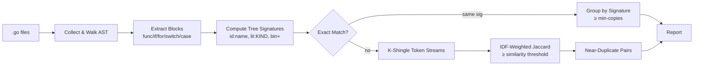

# dupfind

**Structural duplicate and near-duplicate code detector for Go.**

Scan your Go codebase for copy-pasted code — exact copies and near-misses — using AST tree signatures and IDF-weighted Jaccard similarity. Zero third-party dependencies.

[](https://go.dev/)
[](#license)
[](https://github.com/jhgoodwin/dupfind)
[](https://github.com/jhgoodwin/dupfind/actions/workflows/release-unstable.yml)
[](https://github.com/jhgoodwin/dupfind/actions/workflows/release-unstable.yml)

---

## At a Glance

```text
$ dupfind -root ./myproject

scanned 48 files, extracted 124 blocks (min 30 nodes, 5 lines)

=== Exact Duplicates (2 groups) ===

[1] 3 copies, 42 nodes:
    auth/handler.go:45-72   loginHandler
    auth/handler.go:110-137 signupHandler
    billing/webhook.go:60-87 processWebhook

[2] 2 copies, 35 nodes:
    api/users.go:20-40      User.Create
    api/posts.go:15-35      Post.Create

=== Near Duplicates (3 pairs, similarity >= 0.75) ===

[1] similarity: 0.91
    db/conn.go:30-55    connectPostgres (38 nodes)
    db/conn.go:80-105   connectMySQL (36 nodes)

[2] similarity: 0.84
    worker/process.go:50-75  handleItem (42 nodes)
    worker/process.go:90-115 handleBatch (40 nodes)
```

---

## How It Works



Two-phase detection:

1. **Exact duplicates** — Two blocks with identical AST tree signatures are structural copies. Identifier names are preserved (`id:ReadFile`), so renaming doesn't break detection.

2. **Near duplicates** — Blocks that differ slightly (e.g. `> 0` → `>= 1`) are matched via k-shingled token streams scored with IDF-weighted Jaccard similarity. Common Go boilerplate (`if err != nil`) gets down-weighted automatically.

---

## Features

| Feature | Description |
|---|---|
| **Zero dependencies** | Pure Go stdlib — `go/ast`, `go/parser`, `go/token`, `flag` |
| **Exact copy detection** | Groups blocks with identical AST structure |
| **Near-miss detection** | IDF-weighted Jaccard similarity over token shingles |
| **Boilerplate suppression** | Inverse document frequency down-weights common patterns |
| **Sibling case filtering** | Switch/select case clauses within the same parent aren't flagged |
| **Configurable thresholds** | Min nodes, min lines, min copies, similarity threshold |
| **Test-file opt-in** | `_test.go` excluded by default, included with `-tests` |

---

## Installation

### From source

```bash
git clone https://github.com/jhgoodwin/dupfind.git
cd dupfind
make build
cp bin/dupfind ~/.local/bin/
```

### With Go install

> **Note:** `go install` requires a fully-qualified module path. Update `go.mod` to
> `module github.com/jhgoodwin/dupfind` first, then:

```bash
go install github.com/jhgoodwin/dupfind@latest
```

---

## Usage

```text
dupfind [flags]

  -root string
        root directory to scan (default ".")
  -min-nodes int
        minimum AST node count for a block (default 30)
  -min-lines int
        minimum line span for a block (default 5)
  -min-copies int
        minimum copy count for exact duplicates (default 3)
  -sim float
        Jaccard similarity threshold for near-duplicates (default 0.75)
  -tests
        include _test.go files
  -sig
        show tree signatures in output (debugging)
```

### Scan your project

```bash
dupfind -root ./myproject
```

### Relax thresholds for smaller codebases

```bash
dupfind -root . -min-nodes 15 -min-lines 3 -min-copies 2
```

### Include test files

```bash
dupfind -root . -tests
```

### Tighten near-duplicate sensitivity

```bash
dupfind -root . -sim 0.85
```

---

## Examples

### Exact duplicate

These two functions have **identical AST structure** (same identifiers, same literals, same operators):

<div align="center">

| `copy_a.go` | `copy_b.go` |
|---|---|
| `func processFile(path string) (int, error)` | `func processFile(path string) (int, error)` |
| `data, err := os.ReadFile(path)` | `data, err := os.ReadFile(path)` |
| `if err != nil { return 0, fmt.Errorf(...) }` | `if err != nil { return 0, fmt.Errorf(...) }` |
| `count := 0` | `count := 0` |
| `for _, line := range strings.Split(...)` | `for _, line := range strings.Split(...)` |
| `if len(line) > 0 { count++ }` | `if len(line) > 0 { count++ }` |
| `return count, nil` | `return count, nil` |

</div>

```text
=== Exact Duplicates (1 group) ===

[1] 2 copies, 31 nodes:
    testdata/exact/copy_a.go:8-21  processFile
    testdata/exact/copy_b.go:8-21  processFile
```

### Near duplicate

These two differ by one operator (`> 0` vs `>= 1`) but are structurally similar enough to flag:

| `variant_a.go` → `if len(line) > 0` | `variant_b.go` → `if len(line) >= 1` |
|---|---|

```text
=== Near Duplicates (1 pair, similarity >= 0.75) ===

[1] similarity: 0.95
    testdata/near/variant_a.go:9-22   countLines (31 nodes)
    testdata/near/variant_b.go:9-22   countLines (31 nodes)
```

### What gets filtered

- **Sibling switch cases** — case clauses in the same `switch` statement are structurally similar by design, so they're automatically excluded.
- **Shared boilerplate** — `if err != nil` patterns that appear across many blocks get low IDF weight and don't inflate similarity scores.
- **Nested blocks** — A block that is fully contained within another block from the same file is not compared against its parent.

---

## How It Works (Details)

### Block extraction

The tool walks the AST of every `.go` file and extracts code blocks from:

- Function bodies (`FuncDecl`, `FuncLit`)
- Control flow bodies (`IfStmt`, `ForStmt`, `RangeStmt`, `SwitchStmt`, `SelectStmt`)
- Case/comm clauses (`CaseClause`, `CommClause`)

Blocks below the minimum node count (default 30) or line span (default 5) are discarded.

### Tree signatures

Each block is serialized into a structural string:

- Identifiers → `id:ReadFile`, `id:count`
- Literals → `lit:STRING`, `lit:INT`
- Operators → `bin>`, `bin+`, `asgn:=`

Two blocks with the same signature are exact duplicates. The signature preserves identifier names so that structurally similar but semantically different functions (e.g. both read a file and iterate, but use different variable names) are **not** falsely matched.

### K-shingling & IDF

For near-duplicate detection, each block's token stream is broken into k-shingles (contiguous subsequences of k=4 tokens). Shingles that appear in many blocks (boilerplate like `if err != nil`) get low IDF weight. Rare shingles get high weight.

Weighted Jaccard similarity: `sum(min(idf(s) for s in intersection)) / sum(idf(s) for s in union)`

### Candidate generation

An inverted index maps each shingle to the block indices that contain it. Only blocks sharing at least one shingle become candidates — no O(n²) brute force.

---

## Development

```bash
make test         # fast tests
make test-slow    # full suite (with -tags=slow)
make pre-commit   # tidy, fmt, vet, cyclo, coverage, gtags
make build        # build binary
```

The project follows the conventions in [AGENTS.md](./AGENTS.md): boring, idiomatic Go, no third-party dependencies, interfaces at consumer boundaries.

### Test data

The `testdata/` directories serve as executable documentation:

| Directory | Purpose |
|---|---|
| `exact/` | Two identical files — should produce 1 exact group |
| `near/` | Two near-copies + filler for IDF boilerplate — should produce 1 near pair |
| `falsepos/` | Semantically unrelated functions with similar structure — should produce 0 results |
| `siblings/` | Switch cases in the same statement — should produce 0 results |
| `mincopies/` | Three identical files — should produce 1 group with `min-copies=3` |

---

## Project Status

Active. The tool is complete for its current scope. Planned improvements are tracked in [`docs/`](./docs/):

- [Near-duplicate group aggregation](./docs/near-grouping/README.md) — cluster pairwise results into groups
- [Self-check integration](./docs/self-check/README.md) — dogfood `dupfind` on its own source tree

---

## License

MIT
